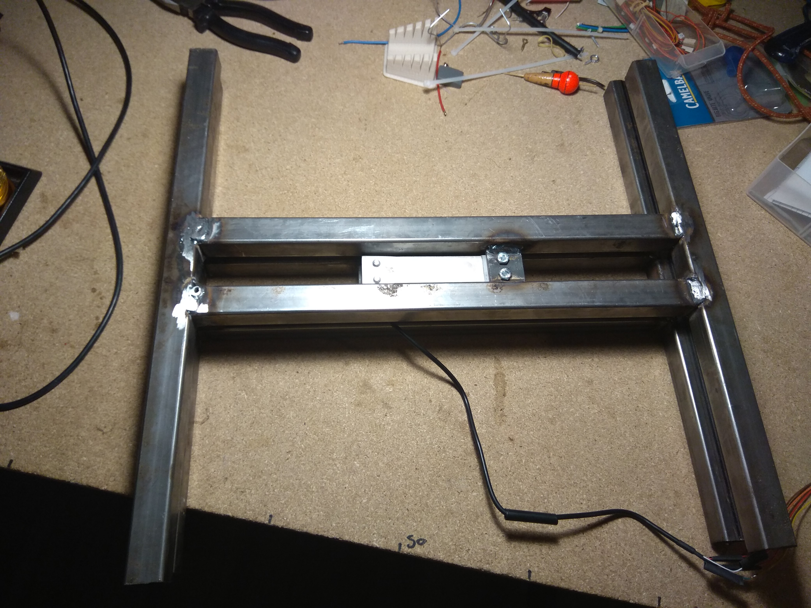

# AirBee

L'idée est de transmettre toutes les données suivantes :
- température dans la ruche -- fait
- humidité dans la ruche -- fait
- masse de la ruche -- fait
- nombre d'abeilles entrées -- en cours
- nombre d'abeille sortie -- en cours
- tension de la batterie -- fait
Via un système 100% autonome en énergie et communication
	
## Coté alimentation : 
- Une lipo 5Ah <http://www.cdiscount.com/telephonie/batteries-telephone/easyacc-batterie-externe-5000mah-ultra-slim-charge/f-14487-eas0700686513077.html> (33€)
- Panneau solaire 3W <https://www.digikey.fr/product-detail/fr/seeed-technology-co-ltd/313070001/1597-1414-ND/5488054> (12USD)
- lipoRider <https://www.seeedstudio.com/Lipo-Rider-v1.3-p-2403.html> (9.5USD)

3 fils partent du module d'alim vers la carte (vcc,gnd,Tbat)

## Coté intelligence :
- Carte ucontrolleur Arduino nano (2€) <https://fr.aliexpress.com/item/Freeshipping-Nano-3-0-controller-compatible-for-arduino-nano-CH340-USB-driver-NO-CABLE/32242060255.html?spm=a2g0s.9042311.0.0.Ohpjts>

## Coté communication :
- Kit Carte Breakout Sigfox BRKWS01 + Antenne +fdp TTC + un an abonnement <https://yadom.fr/carte-breakout-sfm10r1.html> (26€)
ou que le module <https://yadom.fr/reseaux-iot/sigfox/pack-10-modules-wisol-sfm10r1-pour-le-reseau-sigfox.html> (4€) mais il faut payer l'abonnement, sauf que l'on ne peut pas en prendre a l'unit", c'est par 10 pour plus de 220€ par an...

## Coté Capteur :
- pour avoir l'heure RTC  <https://www.adafruit.com/product/3296> (7.5USD) -- pas indispensable
- Compteur I/O abeilles : projet BeeCounter2 (25USD) <http://www.instructables.com/id/Honey-Bee-Counter-II/> 
- Capteur température humidité SHT11 (35USD) (2€ sur Aliexpress) <https://www.adafruit.com/product/246> 
- v1 : Capteur poids X4 + Load Cell Amplifier - HX711 (5€) <https://fr.aliexpress.com/item/FREE-SHIPPING-20pcs-lot-Experiments-body-scale-wholesale-human-scale-load-cell-sensor-resistance-strain-50kg/32271599811.html> et <https://fr.aliexpress.com/item/1PCS-HX711-Weighing-Sensor-Dual-Channel-24-Bit-Precision-A-D-Module-Pressure-Sensor-for-Arduino/32653087154.html?spm=a2g0s.9042311.0.0.zTDiLJ> 

  
  v2 : Un seul capteur 100kg + Load Cell Amplifier - HX711, bcp plus précis et sans dérive (17€) <https://fr.aliexpress.com/item/100kg-120kg-parallel-beam-type-load-cell-for-counting-scale-balance-TAL201/32616652058.html?spm=a2g0s.9042311.0.0.10bb6c37t0ZMNg>

  
## PCB

- v1

- v2

Fait sur Circuit Maker <https://circuitmaker.com/Projects/Details/jeremy-seyssaud/AirBee-simple-version> fabriqué maison dans un premier temps mais commandé chez <https://www.pcbway.com> pour quelques € pour la v2.1.

## Packaging

- Toutes les pièces en impression 3D, les fichiers sont dans le dossier CAD. 

- Connecteurs commandés pour la V2.1 (8€): <https://www.aliexpress.com/snapshot/0.html?spm=a2g0s.9042647.0.0.352f36faI0AsiM&orderId=506229421346969&productId=32761320961>

- Boites commandées pour la V2.1 (6€): <https://fr.aliexpress.com/item/1-Pc-tanche-Bo-tier-En-Plastique-Bo-te-lectronique-Projet-Instrument-Cas-lectrique-Bo-te/32862281438.html?spm=a2g0s.9042311.0.0.32036c37mz9SdR>

## Vue d'ensemble 

- V1 08/10/2017 

- V2 

## Fonctionnement
L'Arduino centralise les données est les envoie au backend sigfox. On a droit à 140 messages de 12 Octets par jour, ca passe juste sans optimisation.

Payload : 
	
	ID::uint:8 Temp::int:16:little-endian Hum::uint:16:little-endian Poids::uint:16:little-endian IN::uint:16:little-endian OUT::uint:16:little-endian Vbat::uint:8

Sigfox renvoie les données via des CallBacks vers serveur perso (php-->json) et backend web (app.we-sens.com)

# RELEASE
- v2 : suppression du RTC / changement capteur de poids et plateau / carte electronique dédiée fait maison

- V2.1 en cours : boite / connecteur / PCB pro / rafraichissement pour les 15 min

# A faire 
- Rajouter le compteur d'abeille

- Rajouter une station météo mais les données capteurs humudité+température+tension batterie (ensoleillement) peuvent suffires.

- Peut etre créer un reseau Xbee local sur 5 ruches pour un seul module Sigfox (si utile d'avoir plusieurs ruches connectées dans le même rucher?)

